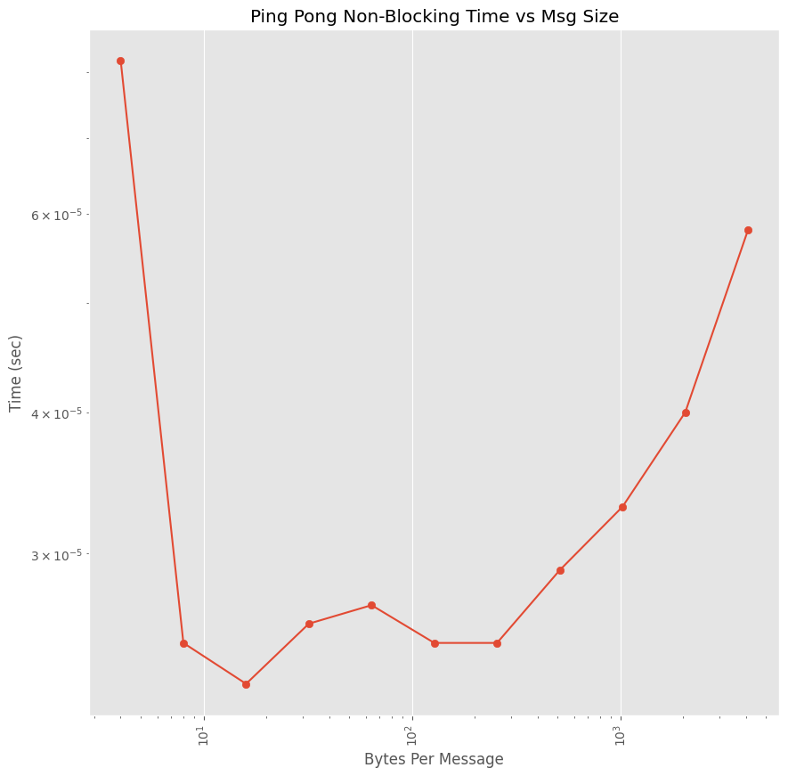

# Group 7 Project 3 Write-up

## Part 1: Blocking Ping-Pong

Your task is to implement the ping-pong problem using MPI in C or C++ and analyze the behavior and performance of your code. Specifically, you should:

1. Implement the ping-pong problem using MPI in C or C++. Use blocking `MPI_Send()` and `MPI_Recv()` calls. You should define the number of iterations and the size of the message to be exchanged.

2. Measure the time taken to complete the ping-pong exchange for different message sizes. You should use the `MPI_Wtime()` function to obtain the time before and after the exchange and calculate the elapsed time. Vary the message size from 2 bytes to 4 kilobytes in powers of 2 (i.e., 2 bytes, 4 bytes, 8 bytes,..., 2048 bytes, 4096 bytes). For each message size, perform 100 iterations of the ping-pong to build up statistical significance.

3. Record the total amount of data sent and received during the ping-pong exchange for each configuration.

| Byte Size | Time (seconds) | Data Sent and Received (bytes) |
| --------- | -------------- | ------------------------------ |
| 2         | 1.88E-06       | 400                            |
| 4         | 8.21E-07       | 8000                           |
| 8         | 8.14E-07       | 16000                          |
| 16        | 9.12E-07       | 32000                          |
| 32        | 9.27E-07       | 64000                          |
| 64        | 1.01E-06       | 128000                         |
| 128       | 9.80E-07       | 256000                         |
| 256       | 1.01E-06       | 512000                         |
| 512       | 1.24E-06       | 1024000                        |
| 1024      | 2.16E-06       | 2048000                        |
| 2048      | 2.65E-06       | 4096000                        |
| 4096      | 4.79E-06       | 81920000                       |

4. Repeat steps 2 and 3 but ensure that the 2 processes that are communicating reside on different physical hardware nodes on HPCC.

| Byte Size | Time (seconds) | Data Sent and Received (bytes) |
| --------- | -------------- | ------------------------------ |
| 2         | 0.00016257     | 400                            |
| 4         | 3.05E-05       | 8000                           |
| 8         | 3.09E-05       | 16000                          |
| 16        | 3.04E-05       | 32000                          |
| 32        | 3.05E-05       | 64000                          |
| 64        | 3.10E-05       | 128000                         |
| 128       | 3.37E-05       | 256000                         |
| 256       | 3.47E-05       | 512000                         |
| 512       | 3.54E-05       | 1024000                        |
| 1024      | 3.61E-05       | 2048000                        |
| 2048      | 3.84E-05       | 4096000                        |
| 4096      | 4.51E-05       | 81920000                       |

5. Plot the average communication time of a single exchange (send and receive) as a function of message size for the two cases. Using this plot, estimate the _latency_ and _bandwidth_ for each case. Are they different? Explain your results.

*Note the following equation:*

$T(n) = \alpha + \beta n$ where $n$ is the number of bytes, $\alpha$ is the latency (measured in seconds), and $\beta ^{-1}$ is the bandwidth (measured in bytes/seconds). 

*The latency for ping-pong on the same nodes is 1E-06 seconds and the bandwidth for ping-pong on the same nodes is around 1.11 GB/s. The latency for ping-pong on different nodes is 5E-05 seconds and the bandwidth for ping-pong on different nodes is around 0.5 GB/s.* 

6. Analyze and discuss your results. Explain the behavior of the resulting curves.

*When going to different nodes, the time is much slower, and the bandwidth is smaller. Hence, the network is better inside the same node. The trend of the lines are similar in the sense that there is a drop between the first byte size and the remaining byte sizes. This may be due to a startup cost at the beginning of running this code. It is interesting to see that right now, the linear line for the graph of the different nodes has a downward trending slope, but this should change if more byte sizes were tested because the time would increase.* 

## Part 2: Non-block Ping-Pong

Repeat Part 1 using non-blocking MPI communication, i.e., using `MPI_Isend()` and `MPI_Irecv()`. You will need to include explicit process synchronization using, e.g., `MPI_Wait()` calls. Compare the results to the blocking case.

| Byte Size | Time (seconds) | Data Sent and Received (bytes) |
| --------- | -------------- | ------------------------------ |
| 4         | 2.2E-05       | 8000                           |
| 8         | 3.9E-05       | 16000                          |
| 16        | 2.4E-05       | 32000                          |
| 32        | 1.14E-04      | 64000                          |
| 64        | 2.0E-05       | 128000                         |
| 128       | 2.27E-05      | 256000                         |
| 256       | 2.7E-05       | 512000                         |
| 512       | 2.6E-05       | 1024000                        |
| 1024      | 3.1E-05       | 2048000                        |
| 2048      | 4.2E-05       | 4096000                        |
| 4096      | 5.5E-05       | 81920000                       |

*Outside of an outlier for the 32 byte message size, the non-blocking follows a similar pattern to the blocking code. generally, it is running slower than the blocking code by an order of magnitude. This could be due to the way that we explicity coded the wait MPI calls. The 32 byte outlier is not present in the blocking code, so it may be due to some outside interference when the test run was done.*

## Part 3: MPI Ring Shift

1. Implement the MPI ring shift in C or C++ for an arbitrary number of processes in the ring and arbitrary message size (i.e., number of elements per process). In your implementation, use `MPI_Sendrecv()` instead of separate `MPI_Send()` and `MPI_Recv()` calls.

2. As in Parts 1 and 2, vary the message size from 2 bytes to 4 kb, in powers of 2. Also vary the number of processes used from 2 to `N`, in powers of 2, where `N` is sufficiently large that rank 0 and rank `N-1` are guaranteed to reside on separate nodes (`N` will depend on which cluster you are using on HPCC).

4 Processes:
| Bytes | Latency   | Bandwidth  |
| ----- | --------- | ---------- |
| 4     | 43.156557 | 0.088392   |
| 8     | 23.513101 | 0.324474   |
| 16    | 0.615604  | 24.786687  |
| 32    | 3.904104  | 7.816794   |
| 64    | 0.559725  | 109.044925 |
| 128   | 0.647269  | 188.592806 |
| 256   | 19.711442 | 12.385731  |
| 512   | 12.978911 | 37.621125  |
| 1024  | 4.412606  | 221.311946 |
| 2048  | 1.973473  | 989.689476 |
| 4096  | 23.202971 | 168.351288 |

8 Processes:
| Bytes | Latency    | Bandwidth  |
| ----- | ---------- | ---------- |
| 4     | 40.338375  | 0.094567   |
| 8     | 9.777956   | 0.780265   |
| 16    | 5.993992   | 2.545681   |
| 32    | 0.53551    | 56.987826  |
| 64    | 22576.5537 | 0.002703   |
| 128   | 1.009554   | 120.915129 |
| 256   | 17.081387  | 14.292787  |
| 512   | 6.001443   | 81.360646  |
| 1024  | 4.811212   | 202.976384 |
| 2048  | 1.88034    | 1038.70827 |
| 4096  | 21.953136  | 177.935856 |

16 Processes:
| Bytes | Latency    | Bandwidth  |
| ----- | ---------- | ---------- |
| 4     | 20454.8724 | 0.000186   |
| 8     | 17.035753  | 0.447846   |
| 16    | 6.120652   | 2.493001   |
| 32    | 0.634231   | 48.117474  |
| 64    | 105.009414 | 0.581235   |
| 128   | 57.661906  | 2.117001   |
| 256   | 1.052395   | 231.985841 |
| 512   | 47.938898  | 10.185492  |
| 1024  | 4.046597   | 241.329344 |
| 2048  | 9.292737   | 210.177591 |
| 4096  | 55.110082  | 70.88086   |

32 Processes:
| Bytes | Latency    | Bandwidth  |
| ----- | ---------- | ---------- |
| 4     | 20458.6079 | 0.000186   |
| 8     | 16.253442  | 0.469402   |
| 16    | 6.114133   | 2.495659   |
| 32    | 0.840984   | 36.287929  |
| 64    | 60.359016  | 1.011202   |
| 128   | 122.397207 | 0.997329   |
| 256   | 80.224127  | 3.043232   |
| 512   | 7.680617   | 63.573178  |
| 1024  | 5.004928   | 195.120208 |
| 2048  | 23.712404  | 82.367228  |
| 4096  | 24.859793  | 157.131233 |

64 Processes:
| Bytes | Latency    | Bandwidth  |
| ----- | ---------- | ---------- |
| 4     | 20582.0398 | 0.000185   |
| 8     | 73.282979  | 0.104109   |
| 16    | 6.003305   | 2.541731   |
| 32    | 0.776723   | 39.290168  |
| 64    | 0.818633   | 74.557452  |
| 128   | 0.989996   | 123.303857 |
| 256   | 1.396984   | 174.762667 |
| 512   | 9915.30065 | 0.049245   |
| 1024  | 150.847249 | 6.47385    |
| 2048  | 22.587366  | 86.469798  |
| 4096  | 26.83606   | 145.559743 |

128 Processes:
| Bytes | Latency    | Bandwidth  |
| ----- | ---------- | ---------- |
| 4     | 20494.9025 | 0.000186   |
| 8     | 14.164485  | 0.538628   |
| 16    | 135.653652 | 0.112483   |
| 32    | 93.009323  | 0.328113   |
| 64    | 5.248934   | 11.628105  |
| 128   | 0.729226   | 167.39719  |
| 256   | 38.606115  | 6.323885   |
| 512   | 199.263915 | 2.450425   |
| 1024  | 6.943941   | 140.635193 |
| 2048  | 4.705042   | 415.113222 |
| 4096  | 26.267953  | 148.707818 |

3. Compute the bandwidth and latency, as above. Plot the bandwidth as a function of message size. Include separate lines for each number of processes used. 

4. Analyze and discuss your results. Explain the behavior of the resulting curves.

 we need a written explanation here 

## Part 4: Non-blocking MPI Ring Shift

Repeat Part 3 but using non-blocking communication via `MPI_Isendrecv()`. Compare the results to the blocking case.

4 Processes:
| Bytes | Latency   | Bandwidth  |
| ----- | --------- | ---------- |
| 4     | 42.392872 | 0.089984   |
| 8     | 8.514151  | 0.896084   |
| 16    | 6.21751   | 2.454164   |
| 32    | 0.742264  | 41.114178  |
| 64    | 12.448989 | 4.90282    |
| 128   | 1.161359  | 105.109864 |
| 256   | 1.150183  | 212.262348 |
| 512   | 33.369288 | 14.632654  |
| 1024  | 2.932735  | 332.98698  |
| 2048  | 3.671274  | 532.002029 |
| 4096  | 33.326447 | 117.211715 |

8 Processes:
| Bytes | Latency   | Bandwidth  |
| ----- | --------- | ---------- |
| 4     | 69.73464  | 0.054703   |
| 8     | 57.866797 | 0.131844   |
| 16    | 6.451271  | 2.365237   |
| 32    | 0.905246  | 33.711934  |
| 64    | 0.672415  | 90.770083  |
| 128   | 0.977889  | 124.830476 |
| 256   | 1.233071  | 197.993958 |
| 512   | 14.159828 | 34.483557  |
| 1024  | 6.582588  | 148.355405 |
| 2048  | 5.831011  | 334.9548   |
| 4096  | 34.303404 | 113.873537 |

16 Processes:
| Bytes | Latency   | Bandwidth  |
| ----- | --------- | ---------- |
| 4     | 46.058558 | 0.082823   |
| 8     | 63.093379 | 0.120922   |
| 16    | 6.399117  | 2.384515   |
| 32    | 0.875443  | 34.859574  |
| 64    | 1.013279  | 60.235294  |
| 128   | 1.17626   | 103.778306 |
| 256   | 1.35228   | 180.539945 |
| 512   | 15.080906 | 32.377447  |
| 1024  | 3.240071  | 301.401552 |
| 2048  | 7.817522  | 249.839409 |
| 4096  | 33.793971 | 115.590145 |

32 Processes:
| Bytes | Latency    | Bandwidth  |
| ----- | ---------- | ---------- |
| 4     | 20405.0019 | 0.000187   |
| 8     | 17.227605  | 0.442859   |
| 16    | 7.042661   | 2.166623   |
| 32    | 0.95088    | 32.094025  |
| 64    | 224.585645 | 0.271768   |
| 128   | 204.73171  | 0.596245   |
| 256   | 1.773238   | 137.680672 |
| 512   | 19.636936  | 24.865449  |
| 1024  | 18.770806  | 52.025602  |
| 2048  | 8.298084   | 235.370595 |
| 4096  | 35.909936  | 108.779086 |

64 Processes:
| Bytes | Latency    | Bandwidth  |
| ----- | ---------- | ---------- |
| 4     | 20418.7473 | 0.000187   |
| 8     | 17.964281  | 0.424698   |
| 16    | 7.3025     | 2.089529   |
| 32    | 76.84622   | 0.397125   |
| 64    | 105.908141 | 0.576303   |
| 128   | 58.586709  | 2.083584   |
| 256   | 5187.69492 | 0.047061   |
| 512   | 82.251616  | 5.936434   |
| 1024  | 129.413791 | 7.546047   |
| 2048  | 16.625039  | 117.480925 |
| 4096  | 34.897588  | 111.934669 |

128 Processes:
| Bytes | Latency    | Bandwidth  |
| ----- | ---------- | ---------- |
| 4     | 20394.6447 | 0.000187   |
| 8     | 57.507306  | 0.132668   |
| 16    | 6.439164   | 2.369685   |
| 32    | 0.759959   | 40.156863  |
| 64    | 1.073815   | 56.839549  |
| 128   | 0.96485    | 126.517375 |
| 256   | 1.39419    | 175.112892 |
| 512   | 19.690022  | 24.798411  |
| 1024  | 13.124198  | 74.40931   |
| 2048  | 20.960346  | 93.181907  |
| 4096  | 62.001869  | 63.002133  |

 we need a table here 

 we need a plot here 

 we need a written explanation here 

